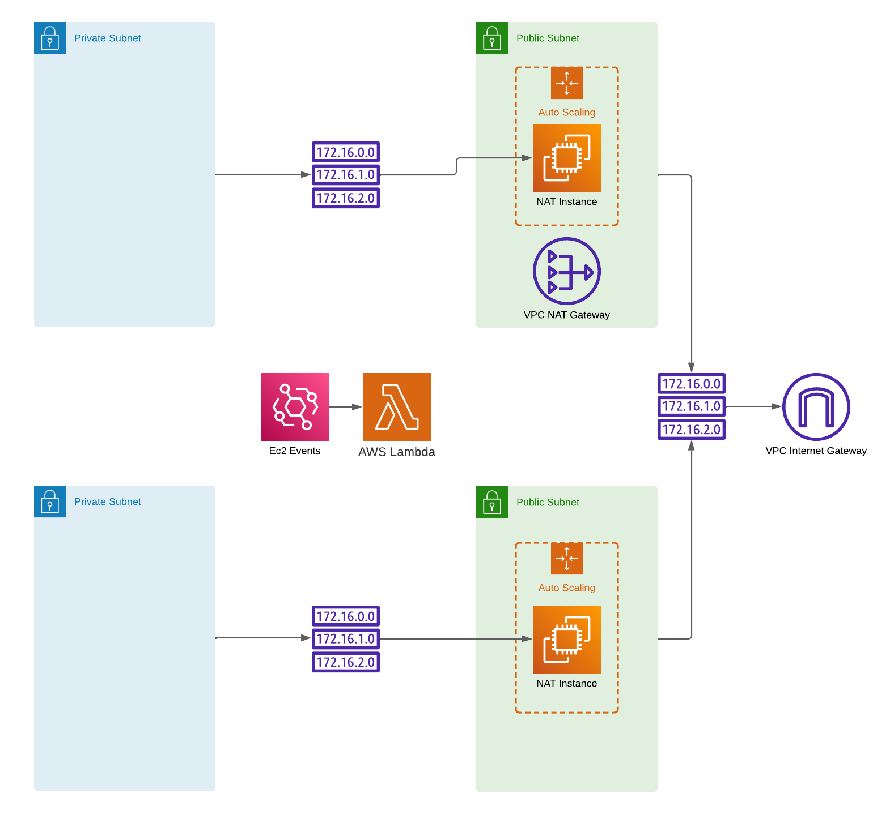
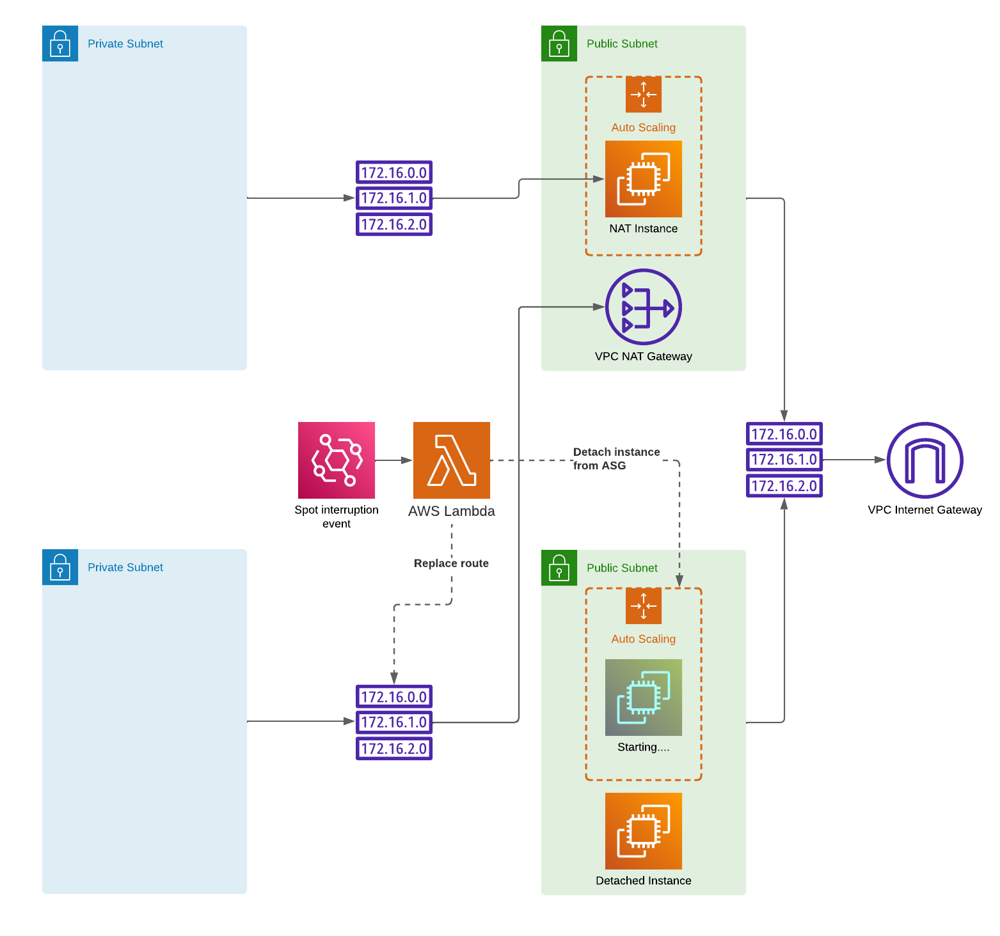

# Spot NAT
Network address translation (NAT) gateways and instances allows resources in your private subnets to initiate connections with the outside world. AWS provides a managed solution for this which is called [NAT-gateways](https://docs.aws.amazon.com/vpc/latest/userguide/vpc-nat-gateway.html). AWS NAT-gateways charges you with a baseline cost of $0.045 per hour and gateway, with an additional $0.045 per GB of processed data. This becomes quite expensive if a lot of data is transferred outside the vpc.

NAT Gateways is the recommended and safe solution since it is managed by AWS, but using NAT instances is becoming more common due to the pricing model. However, if you want a more _chad_ like solution, you should consider NAT:ing your traffic using [spot instances](https://docs.aws.amazon.com/AWSEC2/latest/UserGuide/using-spot-instances.html) ;)

This is a small guide of how to implement this solution. I have provided a terraform module, but it's very straight forward to implement yourself.

## Design
Spot instances always faces the risk of being interrupted, which means that we are required to have a reliable fallback solution. This fallback solution is to have one or more idle NAT gateways. 

Each NAT instance is configured by its own Auto Scaling Group (ASG). The moment a NAT instance receives a spot interruption notice, the routes that points to that instance is immediately replaced with routes that points to a NAT gateway. When the ASG has replaced the terminated instance with a new instance, the traffic is then routed to the newly created instance.

### Event handler
Route table manipulations upon NAT instance state changes are handled by a lambda function, henceforth known as the event handler. The event handler is invoked by Cloudwatch events through AWS EventBridge. The relevant events are of the detail type:
```
EC2 Instance State-change Notification
EC2 Spot Instance Interruption Warning
```

|  | 
|:--:| 
| *A setup that covers two availability zones, using a single fallback NAT gateway* |

#### Spot interruption
When invoked by a spot termination event, the lambda will check the route tables for the affected instance and replace their 0.0.0.0/0 routes with routes to a NAT gateway. The handler then detaches the NAT instance from its ASG, this is to quicken up the process of instance replacement.

|  | 
|:--:| 
| *A spot interruption notice event triggers a fallback and the traffic is routed to the NAT gateway* |

#### State change
The handler will route the traffic to a NAT-gateway the same way it does for a spot interruption when it receives one of the following status changes: _"stopping", "stopped", "shutting-down", "terminated"_. When it receives a status change of "running", the existing routes to 0.0.0.0/0 are replaced with new routes that routes the traffic to the newly started instance.

## Should i use this?
If you don't have any long open connections or can withstand them being potentially disrupted, why the heck _nat_? Existing connections may be disrupted as their traffic will after a route replacement be routed differently. I personally think at least dev and test environments always should be using NAT instances instead of NAT gateways.

## AMI
The recommended approach is to use an AMI instead of loading up a user-data script. AWS provides a useful [guide](https://docs.aws.amazon.com/vpc/latest/userguide/VPC_NAT_Instance.html) that describes how to configure a NAT instance. However, the guide includes a _potential_ pitfall as of 2023-09-25. AWS provides the commands:
```
sudo yum install iptables-services -y
sudo systemctl enable iptables
sudo systemctl start iptables
sudo sysctl -w net.ipv4.ip_forward=1
sudo /sbin/iptables -t nat -A POSTROUTING -o eth0 -j MASQUERADE
sudo service iptables save
```
Iptables creates a default rule in the FORWARDING chain that rejects all traffic. This needs to be dropped, therefore the script also needs to flush the FORWARD chain:
```
iptables -F FORWARD
```

Use Amazon Linux 1 if you are going to utilize the user-data script input. Amazon Linux 2 or your own AMI:s risk not running cloud-init since they have already "started" once before.

I have provided a complete script, _modules/spot-nat/scripts/startup.sh_, that also disables the ENI source/destination checks.

_Edit: AWS updated the documentation within a week after I provided the feedback. It now includes the flush stage._

## Using the module
The provided solution is deployed using Terraform. An example of usage is found in the _main.tf_ file. 

Each element of the _vpc_info_ parameter will create an ASG in the provided subnet. Each NAT instance can be provided with one or more route tables to configure, one NAT Gatway (the ASG:s can use the same) and one elastic ip. Provide a list of similar instance families to spread your instance pool.
